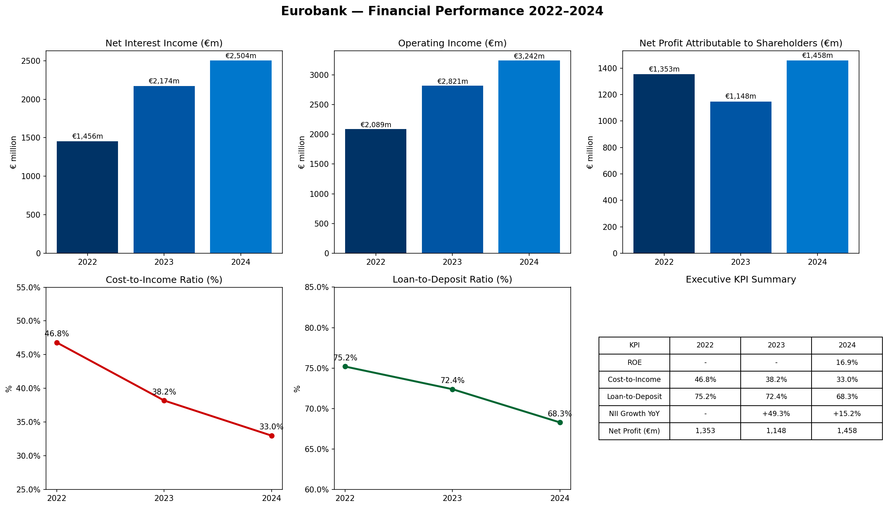

# 🏦 Eurobank Financial Analysis 2022–2024

**End-to-end banking financial analysis pipeline built on real data extracted directly from Eurobank's official Annual Reports — no pre-cleaned datasets used.**

---

## 📊 Dashboard Preview



---

## 🔄 Pipeline

| Step | Tool | Description |
|:-----|:-----|:------------|
| 1. Extract | Python · pdfplumber | Extracted financial tables directly from official Eurobank Annual Report PDFs |
| 2. Clean | pandas | Structured and cleaned P&L and Balance Sheet data |
| 3. Load | SQLite | Loaded into a relational database with 2 tables |
| 4. Query | SQL | KPI calculations using SELECT, JOIN, GROUP BY, Window Functions |
| 5. Analyse | Python · pandas | YoY trends, ROE, Cost-to-Income, Loan-to-Deposit ratios |
| 6. Visualise | Power BI · DAX | Interactive dashboard with slicers and custom DAX measures |

---

## 📈 Key Findings

| KPI | 2022 | 2023 | 2024 |
|:----|:-----|:-----|:-----|
| Net Interest Income | €1,456m | €2,174m | €2,504m |
| Operating Income | €2,089m | €2,821m | €3,242m |
| Net Profit | €1,353m | €1,148m | €1,458m |
| Cost-to-Income | 46.8% | 38.2% | 33.0% |
| Loan-to-Deposit | 75.2% | 72.4% | 68.3% |
| ROE | — | — | 16.9% |

### 💡 Insights
- **NII +72%** over 2 years — driven by higher interest rates and strong loan growth
- **Cost-to-Income improved from 46.8% → 33.0%** — significant efficiency gains
- **Loan-to-Deposit at 68.3%** — healthy liquidity position well below the 80% threshold
- **ROE 16.9%** — above the European banking average (~12%)
- **Net Profit +27% YoY** in 2024 despite a challenging macro environment

---

## 🗂️ Repository Structure

```
eurobank-financial-analysis/
│
├── 01_extract.ipynb          ← Full Python pipeline (extraction, cleaning, SQL, analysis)
├── balance_sheet.csv         ← Consolidated Balance Sheet 2022–2024
├── income_statement.csv      ← Consolidated Income Statement 2022–2024
├── eurobank_dashboard.png    ← Dashboard screenshot
└── eurobank_BI_dashboard.pdf ← Full Power BI dashboard export
```

---

## 🧠 SQL Highlights

```sql
-- Cost-to-Income Ratio trend
SELECT
    'Cost-to-Income Ratio' AS kpi,
    ROUND(ABS(value_2022) * 100.0 / 2089, 1) AS ratio_2022,
    ROUND(ABS(value_2023) * 100.0 / 2821, 1) AS ratio_2023,
    ROUND(ABS(value_2024) * 100.0 / 3242, 1) AS ratio_2024
FROM income_statement
WHERE metric = 'Operating expenses';

-- NII YoY Growth with Window Function
WITH yearly AS (
    SELECT metric, value_2022 AS val, '2022' AS year FROM income_statement
    WHERE metric = 'Net interest income'
    UNION ALL
    SELECT metric, value_2023, '2023' FROM income_statement
    WHERE metric = 'Net interest income'
    UNION ALL
    SELECT metric, value_2024, '2024' FROM income_statement
    WHERE metric = 'Net interest income'
)
SELECT year,
       val AS net_interest_income,
       ROUND((val - LAG(val) OVER (ORDER BY year)) * 100.0 /
             LAG(val) OVER (ORDER BY year), 1) AS yoy_growth_pct
FROM yearly;

-- Executive KPI Summary using JOIN
SELECT
    'ROE 2024' AS kpi,
    ROUND(
        (SELECT value_2024 FROM income_statement
         WHERE metric = 'Net profit attributable to shareholders') * 100.0 /
        (SELECT value_2024 FROM balance_sheet
         WHERE metric = 'Total equity'), 1
    ) || '%' AS value
UNION ALL
SELECT
    'Cost-to-Income 2024',
    ROUND(ABS(
        (SELECT value_2024 FROM income_statement WHERE metric = 'Operating expenses')) * 100.0 /
        (SELECT value_2024 FROM income_statement WHERE metric = 'Operating income'), 1
    ) || '%'
UNION ALL
SELECT
    'Loan-to-Deposit 2024',
    ROUND(
        (SELECT value_2024 FROM balance_sheet
         WHERE metric = 'Loans and advances to customers') * 100.0 /
        (SELECT value_2024 FROM balance_sheet
         WHERE metric = 'Deposits from customers'), 1
    ) || '%';
```

---

## 🛠️ Tools & Technologies

`Python` `pandas` `pdfplumber` `SQLite` `SQL` `Power BI` `DAX` `Jupyter Notebook`

---

## 📁 Data Source

Data extracted directly from Eurobank's official Annual Reports:
- [Annual Financial Report 2023](https://www.eurobank.gr/en/group/investor-relations)
- [Annual Financial Report 2024](https://www.eurobank.gr/en/group/investor-relations)

All figures in € million.
